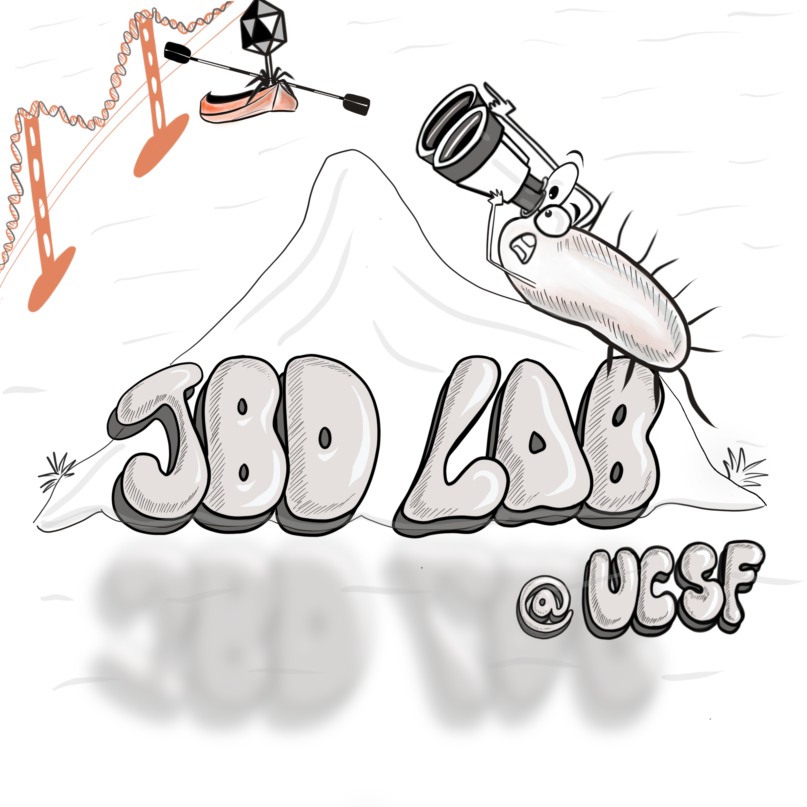

# Welcome to the JBD Lab!
{: .display-4}
 
Our lab focuses on CRISPR-Cas biology. We are in the [Department of Microbiology and Immunology](https://microbiology.ucsf.edu), situated at the fog-free and sunny Mission Bay campus of the University of California, San Francisco.
{: .welcomefont}

{:style="max-width: 100%; height: auto;"}

In the lab, we study the function of CRISPR-Cas bacterial immune systems. We are very interested in investigating the functions of these systems in their host bacteria, exploring both their canonical roles (i.e. targeting bacterial viruses) and non-canonical roles (i.e. gene regulation).
{: .welcomefont}

We are located in Genentech Hall at the Mission Bay Campus of UCSF.
{: .welcomefont}
